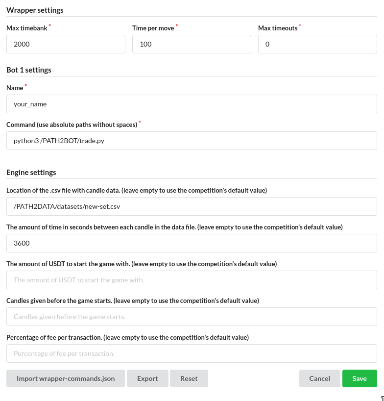
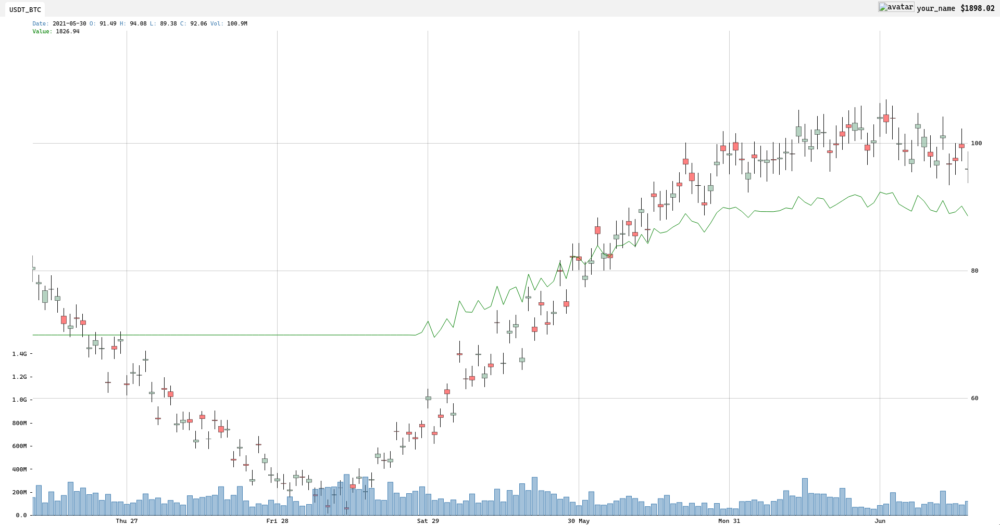
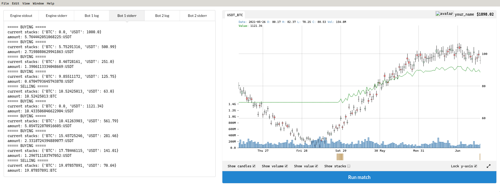
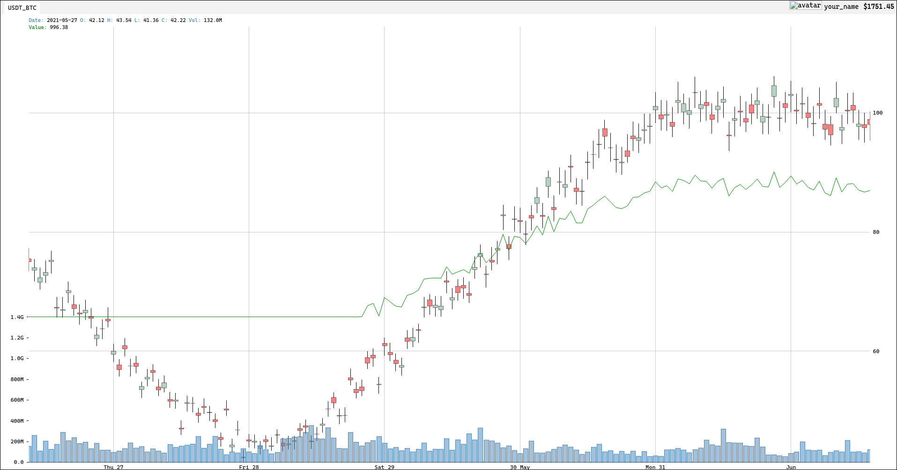
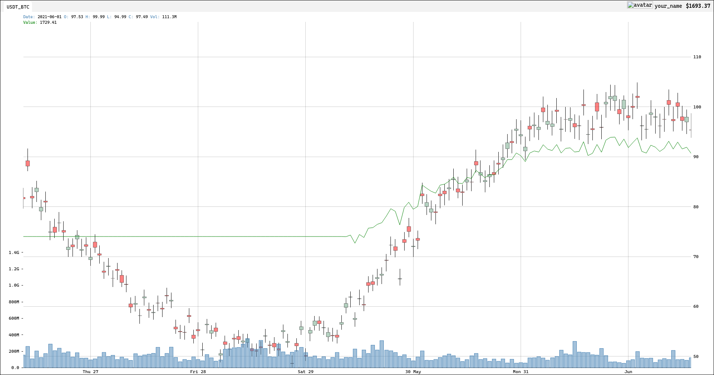

# Computer Numerical Analysis - Trade

## Description
This project aims to introduce us to the challenges of trading and the associated data processing.

## Usage
To use the `trade.py` script, launch the appImage and enter the exact parameters as below in the `File` >> `Settings` section.

Note that every path should be absolute (`/`)

## Results

### High average

w/ stderr

### Mid average

### Low avergage

## EPITECH Students
Beware that I'm not responsible for any -42, you have been warned!

### EPITECH project made by Elwann Guillemot