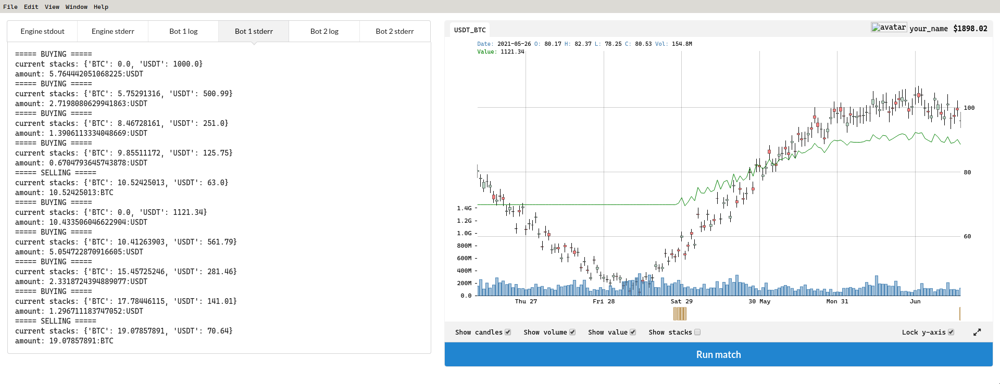

# Computer Numerical Analysis - Trade

## Description
This project aims to introduce us to the challenges of trading and the associated data processing.

## Usage

### Tester
To use the `trade.py` script, launch the appImage given with the subject and enter the exact parameters as below in the `File` >> `Settings` section.

Note that every path should be absolute

<div style="display: flex; justify-content: center;">
    
</div>

### Generator

I also did a generator with random trends, based on a template set (see `datasets/`).
You can modify it as needed.

```sh
python3 set_generator.py
```

It will generate a new `new-set.csv`, which will be used by the tester.

## Results

### High average ~1900$ (+900$)
w/ stderr


### Mid average ~1750$ (+750$)

### Low average ~1650$ (+650$)

## EPITECH Students
Beware that I'm not responsible for any -42, you have been warned!

### EPITECH project made by [Elwann Guillemot](https://github.com/Elwqnn)